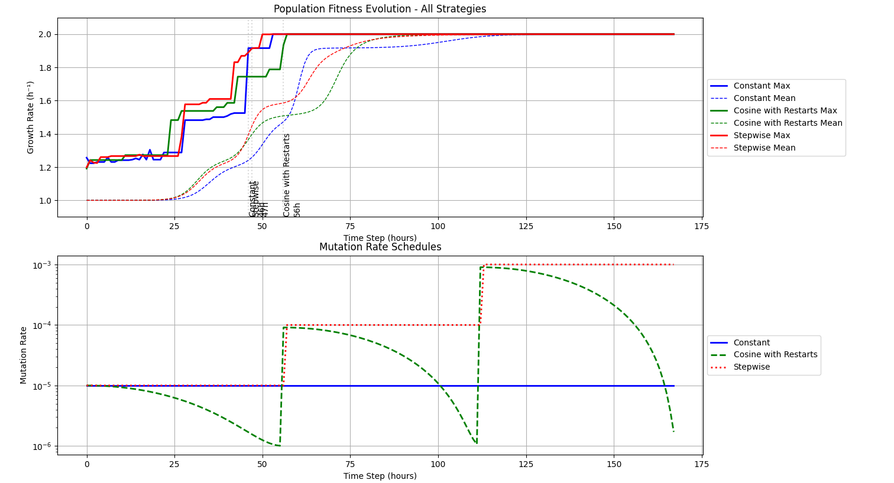

# pyALEsim
*E. Coli* ALE simulator using keras mutation rate schedulers. Install requirements.txt.

Example run with 8M cells (~100µL @ OD0.1) for three days:



## Usage
The program takes three commandline arguments:

```bash
python pyalesim.py <max growth rate (ie 2.0)> <population size (ie 10000)> <num hours (ie 72)>
```
