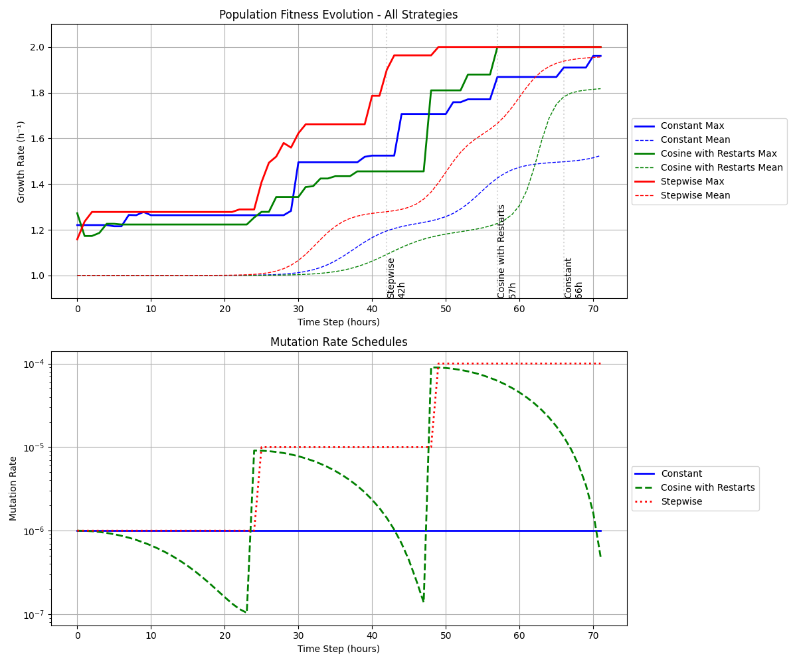

# pyALEsim - Python Adaptive Lab Evolution Simulator
*E. Coli* ALE simulator using keras mutation rate schedulers. Install requirements.txt.

Example run with 8M cells (~100µL @ OD0.1) for three days:



## Usage
The program takes three commandline arguments: maximum growth rate (starts at 1.0), number of cells to simulate (remains constant), and number of hours to run the simulation. Passages are currently fixed at 10% of the population every hour.

```bash
python pyalesim.py 2.0 8000000 72
```
